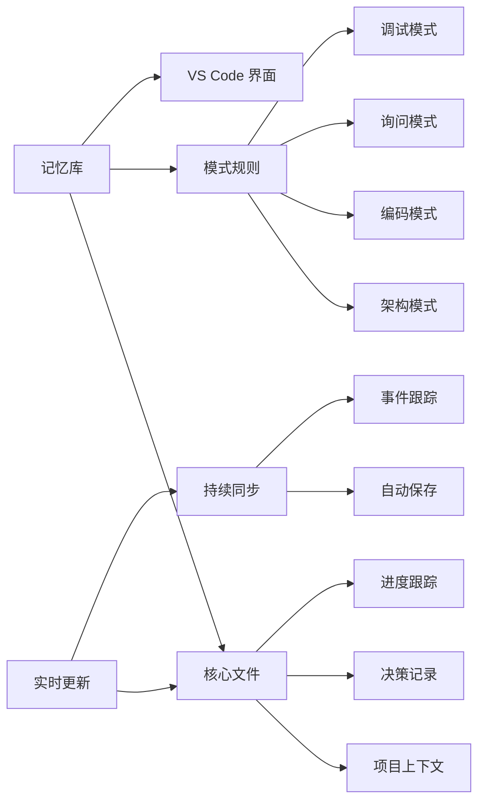
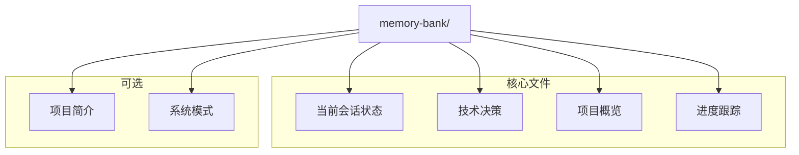
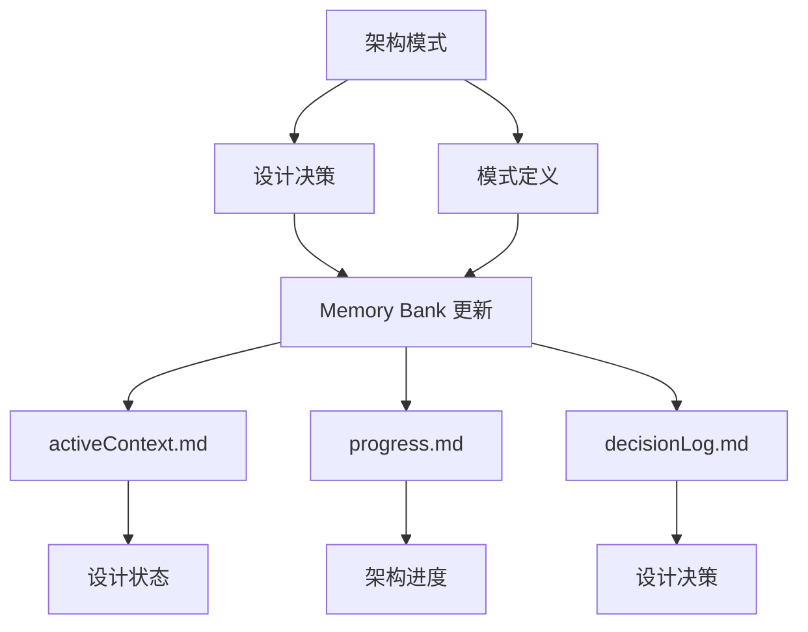
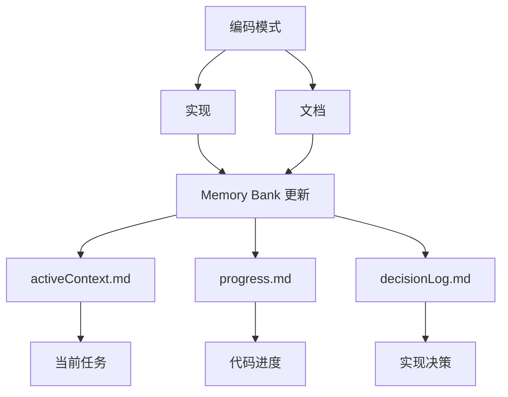
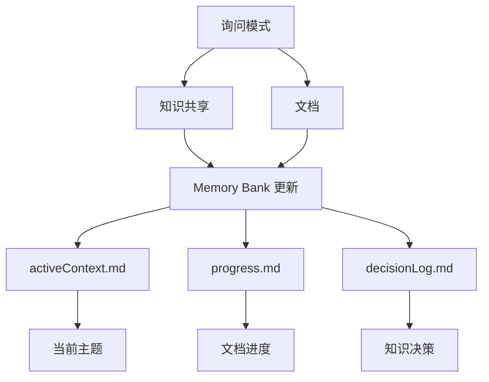
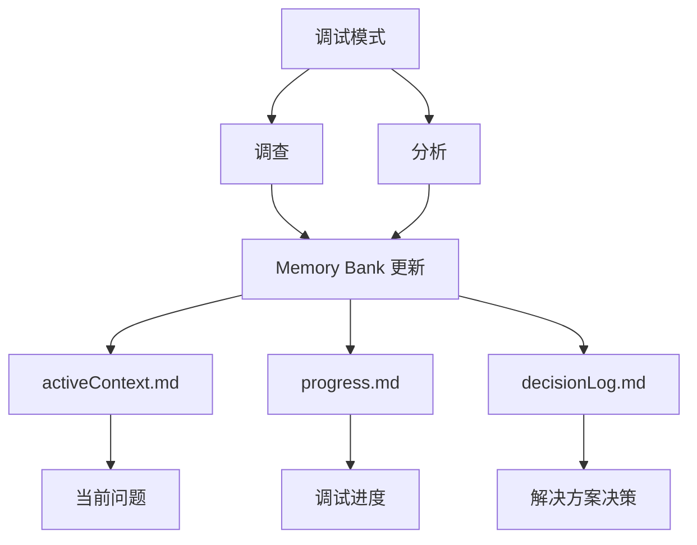

<div align="center">

# 🧠 Roo Code 记忆库

**AI 辅助开发的持久化项目上下文**

[](https://github.com/RooVetGit/Roo-Code)
[](https://github.com/GreatScottyMac/roo-code-memory-bank)

</div>

## 🎯 概述

Roo Code 记忆库解决了 AI 辅助开发中的一个关键挑战：**跨会话保持上下文**。通过与 VS Code 集成的结构化记忆系统，确保你的 AI 助手在多次会话中都能深度理解项目。

### 核心组件



- 🧠 **记忆库**：项目知识的持久化存储
- 📋 **模式规则**：基于 YAML 的行为配置
- 🔧 **VS Code 集成**：无缝开发体验
- ⚡ **实时更新**：持续上下文同步

## 🚀 快速开始

### 1. 特定模式的自定义指令

1. 打开 Roo Code 的提示词设置。
2. 选择要修改的模式。
3. 复制/粘贴对应的 [memory_bank_strategy_"模式".yml](https://github.com/GreatScottyMac/roo-code-memory-bank/tree/main/modules) 文件内容。
4. 保存更改。


### 2. 初始化记忆库

1. 在 Roo Code 聊天中切换到 **架构** 或 **编码** 模式
2. 发送一条消息（例如“你好”）
3. Roo 将自动：
   - 🔍 扫描 `memory-bank/` 目录
   - 📁 如缺失则创建（需经你确认）
   - 📝 初始化核心文件
   - 🚦 提供下一步指引

<details>
<summary>💡 专业提示：项目简介</summary>

在初始化前，于项目根目录创建 `projectBrief.md`，可让 Roo 立即获取项目背景。
</details>

### 文件结构

```
项目根目录/
├── memory-bank/
│   ├── activeContext.md
│   ├── productContext.md
│   ├── progress.md
│   └── decisionLog.md  
└── projectBrief.md
```

## 📚 记忆库结构



<details>
<summary>📖 查看文件说明</summary>

| 文件 | 用途 |
|------|----------|
| `activeContext.md` | 跟踪当前目标、决策和会话状态 |
| `decisionLog.md` | 记录架构选择及其理由 |
| `productContext.md` | 维护高层项目上下文与知识 |
| `progress.md` | 记录已完成工作与待办任务 |
| `projectBrief.md` | 包含初始项目需求（可选） |
| `systemPatterns.md` | 记录复现模式与规范 |

</details>

## ✨ 功能

### 🧠 持久化上下文
- 跨会话记住项目细节
- 保持对代码库的一致理解
- 跟踪决策及其理由

### 📊 知识管理
- 结构化文档，目的明确
- 技术决策跟踪，附带理由
- 自动进度监控
- 交叉引用项目知识

## 💡 专业提示

### 架构模式
Roo Code 记忆库的架构模式专为高层系统设计与项目组织而生。该模式聚焦架构决策、系统结构并保持项目级一致性。

#### 核心能力
- 🏗️ **系统设计**：创建并维护架构
- 📐 **模式定义**：建立编码模式与规范
- 🔄 **项目结构**：组织代码与资源
- 📋 **文档维护**：保持技术文档
- 🤝 **团队协作**：指导实现标准

#### 实时更新触发
架构模式主动监控并更新记忆库文件，基于：
- 🎯 架构决策与变更
- 📊 系统模式定义
- 🔄 项目结构更新
- 📝 文档需求
- ⚡ 实现指导需求

#### 记忆库集成


当需要以下操作时，切换到架构模式：
- 设计系统架构
- 定义编码模式
- 结构化新项目
- 指导实现
- 做架构决策

### 编码模式
Roo Code 记忆库的编码模式是实施与开发的主要接口。该模式专精于编写、修改与维护代码，并遵循既定模式。

#### 核心能力
- 💻 **代码创建**：编写新代码与功能
- 🔧 **代码修改**：更新现有实现
- 📚 **文档编写**：添加代码注释与文档
- ✨ **质量控制**：保持代码规范
- 🔄 **重构**：改善代码结构

#### 实时更新触发
编码模式主动监控并更新记忆库文件，基于：
- 📝 代码实现
- 🔄 功能更新
- 🎯 模式应用
- ⚡ 性能改进
- 📚 文档更新

#### 记忆库集成


当需要以下操作时，切换到编码模式：
- 实现新功能
- 修改现有代码
- 添加文档
- 应用编码模式
- 重构代码

### 询问模式
Roo Code 记忆库的询问模式作为知识库接口与文档助手。该模式擅长提供信息、解释概念并维护项目知识。

#### 核心能力
- 💡 **知识共享**：获取项目洞察
- 📚 **文档编写**：创建与更新文档
- 🔍 **代码解释**：阐明实现
- 🤝 **协作共享**：共享理解
- 📖 **模式教育**：解释系统模式

#### 实时更新触发
询问模式主动监控并更新记忆库文件，基于：
- ❓ 知识请求
- 📝 文档需求
- 🔄 模式解释
- 💡 实现洞察
- 📚 学习成果

#### 记忆库集成


当需要以下操作时，切换到询问模式：
- 理解代码模式
- 获取实现指导
- 创建文档
- 共享知识
- 学习系统概念

### 调试模式
Roo Code 记忆库的调试模式专精于系统化的问题排查与故障解决。该模式采用策略性分析与验证来识别并解决问题。

#### 核心能力
- 🔍 **问题调查**：系统化分析问题
- 📊 **错误分析**：跟踪错误模式
- 🎯 **根因定位**：识别核心问题
- ✅ **方案验证**：验证修复
- 📝 **问题记录**：记录发现

#### 实时更新触发
调试模式主动监控并更新记忆库文件，基于：
- 🐛 缺陷发现
- 📈 性能问题
- 🔄 错误模式
- ⚡ 系统瓶颈
- 📝 修复验证

#### 记忆库集成


当需要以下操作时，切换到调试模式：
- 调查问题
- 分析错误
- 查找根因
- 验证修复
- 记录问题

### 会话管理
- ⚡ **实时更新**：记忆库自动与工作保持同步
- 💾 **手动更新**：在以下情况使用“UMB”或“update memory bank”作为兜底：
  - 意外结束会话
  - 中途停止任务
  - 从连接问题恢复
  - 强制全量同步

## 📖 文档

- [开发者深入指南](/developer-primer-zh.md)
- [更新日志](https://github.com/GreatScottyMac/roo-code-memory-bank/blob/main/updates.md)

---

<div align="center">

**[查看 GitHub](https://github.com/GreatScottyMac/roo-code-memory-bank) • [报告问题](https://github.com/GreatScottyMac/roo-code-memory-bank/issues) • [获取 Roo Code](https://github.com/RooVetGit/Roo-Code)**

</div>

## 许可证

Apache 2.0 © 2025 [GreatScottyMac](LICENSE)
