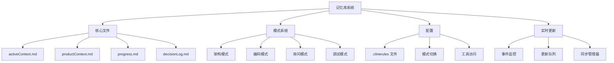
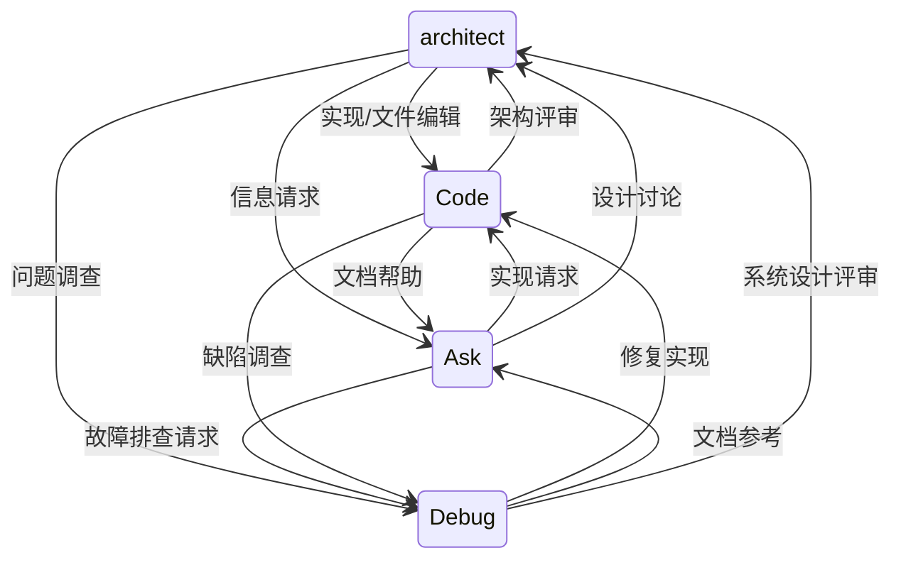

# Roo Code 记忆库：开发者入门指南

## 🏗️ 系统架构

### 核心组件



## 📚 记忆库结构

记忆库系统由 `memory-bank/` 目录组成，包含核心文件和可选文件：


### 核心文件

1. **activeContext.md**
   - 用途：跟踪当前会话状态和目标
   - 内容：
     - 当前任务与目标
     - 最近的变更与决策
     - 待解决问题与阻塞点
     - 会话专属上下文
   - 更新频率：每次会话

2. **productContext.md**
   - 用途：定义项目范围与核心知识
   - 内容：
     - 项目概览与目标
     - 组件架构
     - 技术标准
     - 关键依赖
   - 更新频率：项目范围变更时

3. **progress.md**
   - 用途：跟踪工作状态与里程碑
   - 内容：
     - 已完成工作项
     - 当前任务
     - 后续步骤
     - 已知问题
   - 更新频率：任务推进时

4. **decisionLog.md**
   - 用途：记录重要决策
   - 内容：
     - 技术决策
     - 架构选择
     - 实现细节
     - 备选方案
   - 更新频率：做出决策时


## 🔄 模式系统

### 模式类型

1. **架构模式**
   - 用途：系统设计与架构
   - 能力：
     - 记忆库初始化
     - 架构决策
     - 系统规划
   - 文件访问：仅 Markdown 文件

2. **编码模式**
   - 用途：实现与编码
   - 能力：
     - 完整文件访问
     - 代码生成
     - 文件修改
   - 无文件限制

3. **询问模式**
   - 用途：信息与指导
   - 能力：
     - 上下文理解
     - 文档帮助
     - 最佳实践指导
   - 文件访问：只读

4. **调试模式**
   - 用途：故障排查与问题解决
   - 能力：
     - 系统行为分析
     - 增量测试
     - 根因识别
     - 诊断工具
   - 文件访问：只读

### 智能模式切换



系统支持基于提示分析和操作需求的智能模式切换：

1. **基于意图的触发器**：
   ```yaml
   mode_switching:
     enabled: true
     preserve_context: true
     intent_triggers:
         code:
           - 实现
           - 创建
           - 构建
           - 编码
           - 开发
           - 修复
         debug:
           - 调试
           - 故障排查
           - 诊断
           - 调查
           - 分析
           - 追踪
           - 根因
         architect:
           - 设计
           - 架构
           - 结构
           - 规划
         ask:
           - 解释
           - 帮助
           - 什么
           - 如何
           - 为什么
   ```

2. **基于操作的触发器**：
   - **基于文件**：根据文件操作切换
   - **模式专属**：根据任务类型上下文切换
   - **基于能力**：切换到具备所需能力的模式

3. **上下文保持**：
   - 跨模式保持任务状态
   - 保留对话历史
   - 跟踪活跃文件与操作

4. **收益**：
   - 自然语言驱动的模式选择
   - 无缝上下文过渡
   - 提升工作流效率
   - 任务适配的模式选择


## ⚙️ 配置系统

### .clinerules 文件

1. **.clinerules-architect**
   - 非 Markdown 文件的模式切换
   - 记忆库初始化规则
   - 架构文档标准

2. **.clinerules-code**
   - 完整文件访问配置
   - 代码生成设置
   - 工具访问权限

3. **.clinerules-ask**
   - 只读访问设置
   - 编辑时的模式切换
   - 文档偏好

4. **.clinerules-debug**
   - 只读访问设置
   - 诊断工具权限
   - 日志与追踪配置

### 文件组织

```
project-root/
├── .clinerules-architect
├── .clinerules-code
├── .clinerules-ask
├── .clinerules-debug
├── memory-bank/
│   ├── activeContext.md
│   ├── productContext.md
│   ├── progress.md
│   └── decisionLog.md
└── projectBrief.md
```

## 🛠️ 开发工作流

### 实时更新系统

1. **事件监控**
   - 持续跟踪项目相关事件
   - 模式专属更新触发器
   - 自动事件分类

2. **更新处理**
   - 根据事件类型立即更新文件
   - 异步处理保证性能
   - 基于优先级的更新队列

3. **同步管理**
   - 保持交叉引用
   - 上下文一致性检查
   - 冲突解决

4. **手动兜底（UMB）**
   - 紧急会话终止
   - 任务中段中断
   - 连接恢复
   - 强制同步

### 记忆库初始化

1. 从架构模式开始
2. 系统检查 `memory-bank/`
3. 若缺失：
   - 创建目录
   - 生成核心文件
   - 设置初始上下文

### 会话工作流

1. **会话开始**
   - 系统读取所有记忆库文件
   - 构建全面上下文
   - 加载模式专属规则

2. **会话期间**
   - 按需自动模式切换
   - 在 activeContext.md 中更新上下文
   - 在 progress.md 中跟踪进度

3. **会话结束**
   - 更新 progress.md
   - 在 decisionLog.md 中记录决策
   - 规划后续步骤

## 🔍 最佳实践

1. **记忆库管理**
   - 保持文件聚焦且有序
   - 会话期间定期更新
   - 文件间交叉引用

2. **模式使用**
   - 架构工作先从架构模式开始
   - 让自动切换处理过渡
   - 文档使用询问模式

3. **文档**
   - 记录决策
   - 定期更新进度
   - 保持上下文清晰

## 🐛 故障排查

1. **模式切换问题**
   - 验证 .clinerules 文件
   - 检查文件权限
   - 查看模式切换日志

2. **记忆库问题**
   - 确保核心文件存在
   - 验证文件结构
   - 检查文件权限

3. **上下文问题**
   - 更新 activeContext.md
   - 查看最近变更
   - 检查文件同步


记忆库更新示例：


* productContext.md：
 ```markdown
 # memory-bank/productContext.md

 项目概览
 这是一个[简要描述你的应用——例如“任务管理 Web 应用”]。
 我们正在增加用户认证以提升安全性并个性化用户体验。

 关键技术
 - [列出已有技术]
 - OAuth 2.0（用于社交登录——*待决策：选择哪个提供商？*）
 - JWT（JSON Web Tokens）用于会话管理
 - bcrypt（用于密码哈希）
 ```

* activeContext.md（示例——初始状态）：
 ```markdown
 # memory-bank/activeContext.md

 当前任务
 开发用户认证功能。

 后续步骤
 - 1. 规划用户凭据的数据库模式。
 - 2. 实现用户注册 API 端点。
 - 3. 实现用户登录 API 端点。
 - 4. 实现基于 JWT 的认证中间件。

 待解决问题
 - 选择哪个 OAuth 2.0 提供商（Google、GitHub 等）？
 - 密码复杂度要求？
 - 会话管理策略（如刷新令牌）？
 ```

* progress.md（示例——跟踪进度）：
 ```markdown
 # memory-bank/progress.md

 已完成工作
 - [初始为空]
 - [完成数据库模式设计后]：- 用户凭据的数据库模式已设计并归档。
 - [实现注册 API 后]：- 用户注册 API 端点已实现并测试（基础功能）。
 - [继续随任务完成更新]

 待办
 - [初始列出所有计划任务]
 - 规划用户凭据的数据库模式。
 - 实现用户注册 API 端点。
 - 实现用户登录 API 端点。
 - 实现基于 JWT 的认证中间件。
 - [随任务完成和新任务出现更新]

 当前状态
 用户认证功能——开发中——数据库模式设计进行中。
 - [随开发推进更新状态]——用户认证功能——开发中——用户注册 API 已实现，正在开发登录 API。
 - [完成时]——用户认证功能——已完成并集成。
 ```

收益：

- 全面的功能规划与文档
- 系统化的任务与进度跟踪
- 跨会话保持上下文
- 高效的状态沟通

重构用记忆库：复杂代码模块

记忆库初始化：快速工作流

记忆库初始化基本自动。简化流程如下：

1. **在 VS Code 中打开新项目并切换到架构或编码模式**：Roo Code 会自动检查 `memory-bank/`。
2. **初始化计划**：若 `memory-bank/` 缺失，Roo Code（架构模式）将指导你完成设置。
3. **切换到编码模式**：按 Roo 提示切换到编码模式。
4. **创建记忆库文件**：在编码模式下，按 Roo 计划创建 `memory-bank/` 目录及必要文件。
5. **记忆库就绪**：文件创建完成后，记忆库初始化完成即可使用。


工作区多项目管理


若你在 VS Code 工作区中有多个项目，各自拥有记忆库，Roo Code 可自动检测并提示你为当前聊天会话选择目标项目。

工作区多项目管理


若你在 VS Code 工作区中有多个项目，各自拥有记忆库，Roo Code 可自动检测并提示你为当前聊天会话选择目标项目。


自动项目检测与选择：


1. 新聊天会话：在架构或编码模式下启动新聊天时，Roo Code 会扫描工作区中的 `memory-bank/` 目录。
2. 发现多个记忆库：若检测到多个 `memory-bank/` 目录，Roo Code 将在聊天中显示提示，要求你选择要处理的项目。
3. 项目选择提示：Roo Code 将显示类似如下的提示：

```text
检测到多个记忆库。

请为本会话选择项目：

1. poptools-app
2. Roo-Code
3. roo-code-memory-bank

输入项目编号。
```
4. 选择项目：输入对应编号并回车。
5. 加载上下文：Roo Code 随后加载所选项目的记忆库并用于当前聊天。

示例场景：多项目工作区

假设你有一个工作区包含 `webapp` 和 `mobile-app` 两个项目，各自根目录下都有 `memory-bank/`。

在架构模式下发起新聊天时，Roo Code 将检测到两个记忆库并要求你选择本次会话要聚焦的项目。提示类似：

```text
检测到多个记忆库。

请为本会话选择项目：

1. webapp
2. mobile-app

输入项目编号。
```
选择“1”后，Roo Code 将使用 `webapp` 项目的记忆库进行本次会话。

通过选择“1”，你确保 Roo Code 本次会话使用 `webapp` 项目的记忆库。


组织多项目工作区：


为高效管理带记忆库的多项目：

* 记忆库置于项目根目录：确保每个项目的 `memory-bank/` 目录位于其项目根目录。
* 清晰的项目名称：使用描述性目录名，便于在项目选择提示中快速识别。
* 工作区结构：清晰分隔各项目目录。

此自动检测与选择功能简化了多项目协作，确保 Roo Code 每次会话都能获得正确的项目上下文。


自动项目检测与选择：


1. 新聊天会话：在架构或编码模式下启动新聊天时，Roo Code 会扫描工作区中的 `memory-bank/` 目录。
2. 发现多个记忆库：若检测到多个 `memory-bank/` 目录，Roo Code 将在聊天中显示提示，要求你选择要处理的项目。
3. 项目选择提示：Roo Code 将显示类似如下的提示：

```text
检测到多个记忆库。

请为本会话选择项目：

1. poptools-app
2. Roo-Code
3. roo-code-memory-bank

输入项目编号。
```
4. 选择项目：输入对应编号并回车。
5. 加载上下文：Roo Code 随后加载所选项目的记忆库并用于当前聊天。

示例场景：多项目工作区

假设你有一个工作区包含 `webapp` 和 `mobile-app` 两个项目，各自根目录下都有 `memory-bank/`。

在架构模式下发起新聊天时，Roo Code 将检测到两个记忆库并要求你选择本次会话要聚焦的项目。提示类似：

```text
检测到多个记忆库。

请为本会话选择项目：

1. webapp
2. mobile-app

输入项目编号。
```
选择“1”后，Roo Code 将使用 `webapp` 项目的记忆库进行本次会话。

通过选择“1”，你确保 Roo Code 本次会话使用 `webapp` 项目的记忆库。


组织多项目工作区：


为高效管理带记忆库的多项目：

* 记忆库置于项目根目录：确保每个项目的 `memory-bank/` 目录位于其项目根目录。
* 清晰的项目名称：使用描述性目录名，便于在项目选择提示中快速识别。
* 工作区结构：清晰分隔各项目目录。

此自动检测与选择功能简化了多项目协作，确保 Roo Code 每次会话都能获得正确的项目上下文。

重构用记忆库更新示例：


* activeContext.md（重构计划与进度）：
 ```markdown
 # memory-bank/activeContext.md

 当前任务
 重构复杂的 `utils/legacy_module.py` 模块。

 重构策略
 - 1. 分析 `utils/legacy_module.py`
 - 2. 拆分为更小模块/函数
 - 3. 改进命名与文档
 - 4. 编写单元测试
 - 5. 逐步重构并测试

 待重构文件
 - `utils/legacy_module.py`

 重构进度
 - [初始为空]
 - [分析后]：- 已完成 `utils/legacy_module.py` 分析。重构策略已归档。
 - [拆分后]：- 核心函数已拆分为 `utils/refactored_module/` 中的更小模块。
 - [继续随重构推进更新]

 待解决问题
 -  对 `utils/legacy_module.py` 的依赖？
 -  预计重构耗时？
 ```

* decisionLog.md（重构决策与发现）：
 ```markdown
 # memory-bank/decisionLog.md

 重构 `utils/legacy_module.py` - 决策

 - [日期]：决策：按功能区域拆分 `legacy_module.py`。
  - 理由：提升模块化与可维护性。
  - 备选：原地重构（已拒绝——影响较小）。

 - [日期]：决策：使用描述性命名与全面文档字符串。
  - 理由：提升代码可读性。
  - 备选：最小化文档（已拒绝——不足）。
 ```

* progress.md（跟踪重构进度）：
 ```markdown
 # memory-bank/progress.md

 已完成工作
 - [初始为空]
 - [分析与规划后]：- `utils/legacy_module.py` 的重构计划已记录在 `activeContext.md` 与 `decisionLog.md`。
 - [拆分后]：- `legacy_module.py` 的核心函数已拆分为 `utils/refactored_module/` 中的更小模块。
 - [继续随重构推进更新]

 待办
 - [初始列出所有重构任务]
 - 分析 `utils/legacy_module.py`。
 - 拆分为更小模块/函数。
 - 改进命名与文档。
 - 为重构后模块编写单元测试。
 - 逐步重构并测试每个模块。
 - 集成重构后模块。
 - 重构后验证功能。
 - [随任务完成更新]

 当前状态
 重构 `utils/legacy_module.py`——规划完成。
 - [随重构推进更新状态]——重构 `utils/legacy_module.py`——进行中——核心函数拆分完成。
 - [完成时]——重构 `utils/legacy_module.py`——已完成并验证。
 ```

收益：

- 系统化重构规划与管理
- 记录策略、决策与进度
- 跟踪上下文与待解决问题
- 提升团队协作

缺陷修复用记忆库：用户登录缺陷


记忆库更新示例：


* activeContext.md（缺陷调查与详情）：
 ```markdown
 # memory-bank/activeContext.md

 当前任务
 调试用户登录缺陷。

 缺陷详情
 - 现象：登录后跳转回并提示“凭据无效”。
 - 报告人：用户（支持票据 #123、#124、#125）。
 - 影响用户：全部用户。
 - 环境：所有浏览器/平台。
 - 最后可用版本：v1.2.0（怀疑 v1.2.1 回归）。

 复现步骤
 1. 进入登录页。
 2. 输入有效用户名与密码。
 3. 提交登录表单。
 4. 观察到“凭据无效”错误。

 调查进度
 - [初始为空]
 - [调查后]：- 服务器日志正常。`auth/login.py` 代码审查——正常，需调试器。
 - [下一步]：- 调试登录流程。
 ```

* decisionLog.md（调试决策与发现）：
 ```markdown
 # memory-bank/decisionLog.md

 缺陷修复 - 用户登录缺陷 - 决策

 - [日期]：决策：调试 `auth/login.py` - 密码哈希。
  - 发现：密码哈希逻辑正确，密码比对失败。

 - [日期]：决策：调查密码比对与 bcrypt 版本。
  - 理由：怀疑 bcrypt 不兼容。
  - 行动：回退 bcrypt 版本（快速验证）。

 - [日期]：决策：回退 bcrypt。登录——正常。
  - 发现：回退 bcrypt 修复缺陷。确认 bcrypt 问题。
  - 后续：记录 bcrypt 问题，长期修复。
 ```

* progress.md（缺陷修复进度）：
 ```markdown
 # memory-bank/progress.md

 已完成工作
 - [初始为空]
 - [初步调查后]：- 用户登录缺陷已记录于 `activeContext.md`。调试开始。
 - [识别 bcrypt 问题后]：- 根因：bcrypt 不兼容。临时修复：回退 bcrypt 版本。

 待办
 - [初始，缺陷修复任务]
 - 调查用户登录缺陷。
 - 识别根因。
 - 实施临时修复（bcrypt 回退）。
 - 验证临时修复。
 - 调查长期 bcrypt 方案。
 - 实施长期修复。
 - 回归测试。
 - 部署修复。
 - 监控登录。
 - [按需更新任务]

 当前状态
 用户登录缺陷——调查中——已识别根因（bcrypt 不兼容）。临时修复已实施/验证。
 - [随缺陷修复推进更新状态]——用户登录缺陷——修复已实施并验证。——临时修复已部署。监控中。
 - [完成时]——用户登录缺陷——已修复（已实施长期方案）。——长期修复已部署。已增加回归测试。
 ```

收益：

- 系统化调试
- 记录缺陷详情与决策
- 跟踪缺陷修复进度
- 调试期间保持上下文
- 促进知识共享

故障排查


`[MEMORY BANK: ACTIVE]` 前缀不起作用


解决方案：检查自定义指令
1. 验证 VS Code 中的自定义指令设置：确保“Roo Code 提示词”设置中所有自定义指令模块配置正确，特别是“模式专属自定义指令/编码”。
 * 详细验证清单：
  - [ ] **全局指令：**确认已将 `roo-code-memory-bank/custom-instructions/global-instructions.md` 的*全部内容*复制并粘贴到 VS Code 设置中“Roo Code 提示词”部分的“全局指令”。
  - [ ] **模式专属指令/架构：**确认已将 `roo-code-memory-bank/custom-instructions/mode-arch.md` 的*全部内容*复制并粘贴到“模式专属指令/架构”设置。
  - [ ] **模式专属指令/询问：**确认已将 `roo-code-memory-bank/custom-instructions/mode-ask.md` 的*全部内容*复制并粘贴到“模式专属指令/询问”设置。
  - [ ] **模式专属指令/编码：***关键地*，确认已将 `roo-code-memory-bank/custom-instructions/mode-code.md` 的*全部内容*复制并粘贴到“模式专属自定义指令/编码”设置。**此设置对于编码模式下 `[MEMORY BANK: ACTIVE]` 前缀正常工作至关重要。**
 * 内容完整性：再次确认你*完整*复制了*每个*指定文件的内容并粘贴到*对应*的设置区域，确保复制粘贴过程中没有遗漏或损坏。
2. 保存设置：确认粘贴指令后已保存 VS Code 设置。
3. 确认编码模式：确保使用 `[MEMORY BANK: ACTIVE]` 前缀时处于“编码”模式（检查 Roo Code 聊天界面）。
4. 检查前缀语法：确认精确语法：`[MEMORY BANK: ACTIVE]`（区分大小写，空格）。


VS Code 重启后记忆库未保留


解决方案：
1. 验证记忆库初始化：确认你已通过在新建项目中切换到架构模式来启动记忆库初始化流程（见“入门”部分）。检查执行架构模式下 Roo Code 提供的初始化计划后，是否在项目根目录生成了 `memory-bank/` 文件夹及必需文件。
2. 初始模式切换：VS Code 重启后，*首先*切换到“询问”或“架构”模式以触发记忆库加载。
3. 使用“更新记忆库”（UMB）命令：会话结束时，单独输入“update memory bank”或**“UMB”**作为独立提示，以显式触发全面记忆库更新，为下一会话做好准备。
4. 检查文件路径：确认 `memory-bank/` 文件夹位于项目根目录；错误路径会阻止记忆库访问。


.clinerules 规则未生效


解决方案：
1. 文件位置：确保 `.clinerules` 文件（`.clinerules`、`.clinerules-code` 等）位于项目根目录，与 `memory-bank/` 文件夹并列。
2. 语法检查：验证 `.clinerules` 文件语法；语法错误可能导致规则被忽略。
3. 模式相关性：注意 `.clinerules-code`、`.clinerules-architect`、`.clinerules-ask` 是模式专属的。
4. （罕见）重启 Roo Code：重大 `.clinerules` 更改后，在 VS Code 中重启 Roo Code 以重新加载规则。


记忆库文件未更新/保存


解决方案：
1. 文件权限：检查 `memory-bank/` 文件夹及文件的写入权限。
2. VS Code 错误：查看 VS Code 控制台是否有文件保存错误。
3. 冲突扩展：临时禁用可能干扰保存的扩展。
4. 磁盘空间：确保有足够可用磁盘空间。


若问题持续，请参考 Roo Code 文档或社区支持渠道获取进一步帮助。


关于“更新记忆库”（UMB）命令的修订指南：


尽管并非每次中断后都*必须*，但使用**“更新记忆库”（UMB）命令**（在聊天中单独输入“update memory bank”或“UMB”作为独立提示）是*强烈建议的最佳实践*，可实现健壮的会话管理并确保长期项目上下文的保留。**将 UMB 作为独立提示触发，可确保对所有记忆库文件进行全面更新，保证项目知识准确且持久。**


为可视化此会话管理流程，请参考下方工作流图：


会话管理工作流（`update memory bank` 命令）


[//]: # (TODO: 如下 ASCII 图替换为可视化流程图)
[//]: # (可视化流程图应展示带 `update memory bank` 命令的会话管理工作流。相比当前 ASCII 图，流程图更友好。)


1. 开始：处理项目（任意模式）
2. 步骤 1：用户更改记忆库文件（`productContext.md`、`activeContext.md`、`progress.md` 等）
3. 步骤 2：会话结束或中断？
 是：用户在聊天中发起 `update memory bank` 命令
 否：继续处理（返回步骤 1）
4. 步骤 3：Roo Code 保存记忆库文件当前状态
5. 步骤 4：记忆库为下一会话做好准备
6. 结束：会话已管理且记忆库已更新


可理解为：
* `[MEMORY BANK: ACTIVE]` 前缀：确保编码模式下 Roo 使用*已归档、可靠*的项目上下文（内存重置时重要）。
* `update memory bank` 命令：“保存项目知识”命令。用于：
  * 会话结束/中断时更新记忆库。
  * 为关闭 VS Code/切换工作区做准备。
  * 创建项目历史检查点。
